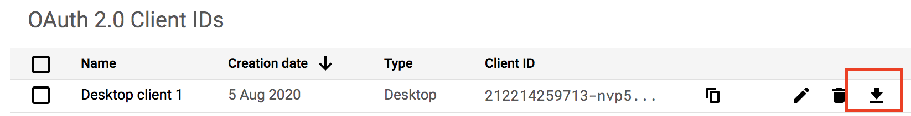

## Google Tasks Desktop

> Unofficial google tasks desktop application. Using React and google tasks api

<div>
  
  
  
  
</div>

#### [Download](https://github.com/Pong420/google-tasks-desktop/releases)

#### :warning: You will need to enable your own [Google Tasks API](https://console.developers.google.com/apis/library/tasks.googleapis.com) whether you are user or developer.

#### Step to enable Google Tasks API.

1. Follow the instruction in https://support.google.com/cloud/answer/6158849 to setup your `OAuth consent screen` and `Credentials` ( In step 6, you should select `Desktop app` as the application type )

2. After the OAuth client created, you could download the `oAuth.json` by clicking this button



And the `oAuth.json` looks like this

```json
{
  "installed": {
    "client_id": "...",
    "project_id": "...",
    "auth_uri": "https://accounts.google.com/o/oauth2/auth",
    "token_uri": "https://oauth2.googleapis.com/token",
    "auth_provider_x509_cert_url": "https://www.googleapis.com/oauth2/v1/certs",
    "client_secret": "...",
    "redirect_uris": ["urn:ietf:wg:oauth:2.0:oob", "http://localhost"]
  }
}
```

3. Start and drag the `oAuth.json` into the application.

4. Click on the `Get Code` button and will require authentication. Just ignore the `This app isn't verified` warning and continue because you are the app owner.

5. Paste the code into the input filed and click the `Confirm` button.

### Development

```
yarn dev
```

### Packaging

To package apps for the local platform:

```
yarn package
```

First, refer to the [Multi Platform Build docs](https://www.electron.build/multi-platform-build) for dependencies. Then,

```
yarn package-all
```

### TODO

- [x] Support Window & Linux
- [x] Keyboard shortcuts
- [x] Dark Theme
- [x] Add Note
- [x] Add Date
- [x] Animation
- [x] Sync data periodically
- [x] Move task to another list
- [x] Improve / check performace
- [ ] Subtask
- [ ] Error handling

### Known issue

- Add time / repeat is not supported as API limitation
- Tasks sorting type (My order / Date) is not synced to the official platform (Web/App)
- The position of the task which marks as complete to incomplete may be different after refresh
