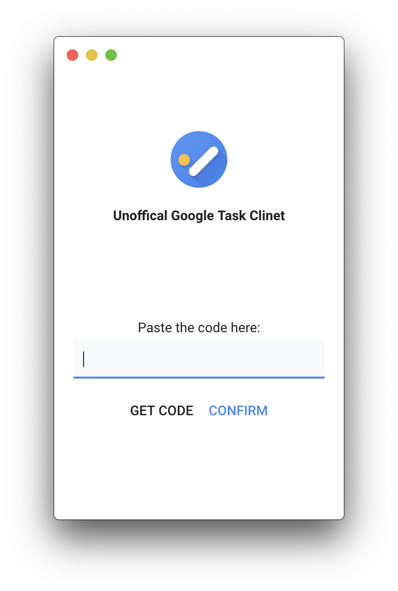
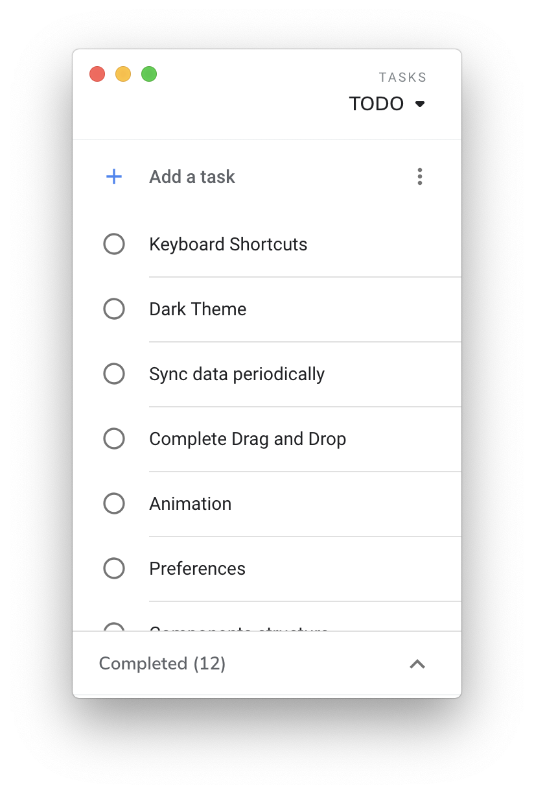

## Google Tasks Desktop (WIP)

:warning: Project still working in prorgress. Don't use it if you have important data in google tasks

<div>
  
  
</div>

### Project Setup

- yarn is required, otherwise you should replace `yarn` in `package.json` and `scripts/electron-wait-react.js`

- Enable [Google Task API](https://console.developers.google.com/apis/library/tasks.googleapis.com)

- Setup your [OAuth consent screen](https://console.developers.google.com/apis/credentials/consent) in Google API Console

- In Google API Console [Credentials](https://console.developers.google.com/apis/credentials) section.
  Create credentials => OAuth client ID => Other => Create. After, you should get a json file like this.

  ```json
  {
    "installed": {
      "client_id": "...",
      "project_id": "...",
      "auth_uri": "https://accounts.google.com/o/oauth2/auth",
      "token_uri": "https://oauth2.googleapis.com/token",
      "auth_provider_x509_cert_url": "https://www.googleapis.com/oauth2/v1/certs",
      "client_secret": "...",
      "redirect_uris": ["urn:ietf:wg:oauth:2.0:oob", "http://localhost"]
    }
  }
  ```

- Finally rename the json file to `oauth2.keys.json` and put it into `src/constants`

### Know Issue

Any actions on a new task that created recently may cause error.

- New task => Edit the task immediate => Drag the task to other postion. Your change may not recorded

### Development

```
yarn dev
```

### Packaging

Before packaging you may edit the build config in `package.json` which prefix with `REPLACE_`.

To package apps for the local platform:

```
yarn package
```

First, refer to the [Multi Platform Build docs](https://www.electron.build/multi-platform-build) for dependencies. Then,

```
yarn package-all
```
