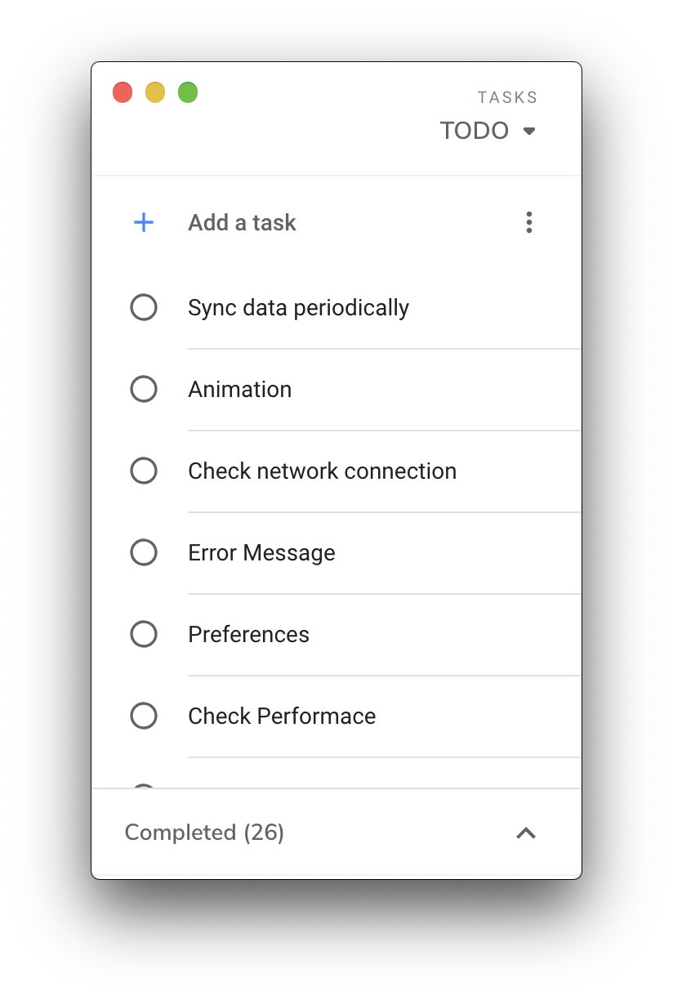

## Google Tasks Desktop (WIP)

:warning: Project still working in prorgress. Don't use it if you have important data in google tasks

<div>
  
  
  
  
</div>

### Project Setup

`yarn` is required, otherwise you should replace `yarn` in `package.json` and `scripts/electron-wait-react.js`

1. Enable [Google Task API](https://console.developers.google.com/apis/library/tasks.googleapis.com)

2. Setup your [OAuth consent screen](https://console.developers.google.com/apis/credentials/consent) in Google API Console

3. In Google API Console [Credentials](https://console.developers.google.com/apis/credentials) section.
   Create credentials => OAuth client ID => Other => Create. After, you should get a json file like this.

```json
{
  "installed": {
    "client_id": "...",
    "project_id": "...",
    "auth_uri": "https://accounts.google.com/o/oauth2/auth",
    "token_uri": "https://oauth2.googleapis.com/token",
    "auth_provider_x509_cert_url": "https://www.googleapis.com/oauth2/v1/certs",
    "client_secret": "...",
    "redirect_uris": ["urn:ietf:wg:oauth:2.0:oob", "http://localhost"]
  }
}
```

4. Finally rename the json file to `oauth2.keys.json` and put it into `src/constants`

### TODO

- [x] Support Window & Linux
- [x] Keyboard shortcuts
- [x] Dark Theme
- [x] Add Note
- [x] Add Date
- [ ] ~~Improve / check performace~~
- [ ] Error handling
- [ ] Sync data periodically
- [ ] Animation

### Know issue

- Add time is not supported as API limitation
- Once you add/edi the `date` through official platform (Web/App). The `date` shown in the official platform (Web/App) will not be update,
  if you change the `date` in this application.
- For tasks sort by date
  - Move task up/down shortcut is not supported currently.
  - Tasks sort by date or order is not synced to the official platform (Web/App)

### Development

```
yarn dev
```

### Packaging

Before packaging you may edit the build config in `package.json` which prefix with `REPLACE_`.

To package apps for the local platform:

```
yarn package
```

First, refer to the [Multi Platform Build docs](https://www.electron.build/multi-platform-build) for dependencies. Then,

```
yarn package-all
```
